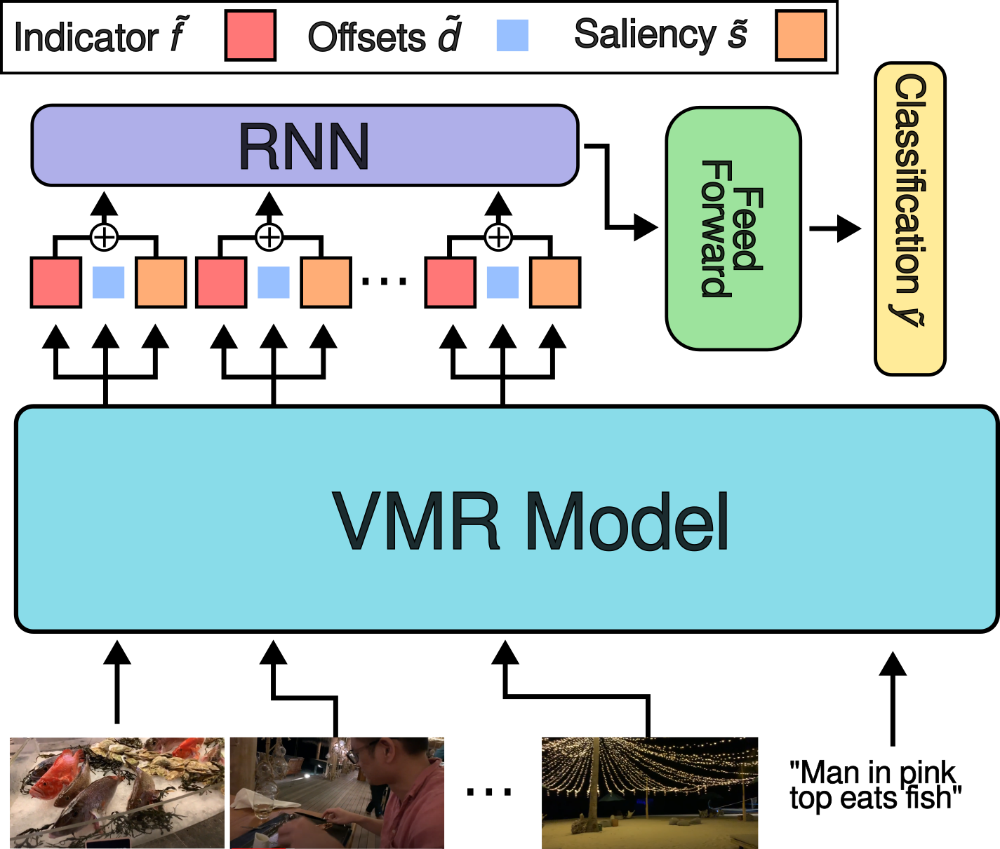

---
# Feel free to add content and custom Front Matter to this file.
# To modify the layout, see https://jekyllrb.com/docs/themes/#overriding-theme-defaults

layout: default
---
<h1><p style="text-align: center;"><a href="https://keflanagan.github.io">Kevin Flanagan</a>, <a href="https://dimadamen.github.io">Dima Damen</a>, <a href="https://mwray.github.io/">Michael Wray</a></p></h1>
<p style="text-align: center;">University of Bristol</p>

<i>The classification head for NA-VMR is added to a Video Moment Retrieval model (UniVTG in this case) via summation of the indicator and saliency scores, which are then passed through a recurrent layer and a feed forward layer before producing a single value output for classification.</i>
## Abstract

Video Moment Retrieval is a common task to evaluate the performance of visual-language models—it involves localising start and end times of moments in videos from query sentences. The current task formulation assumes that the queried moment is present in the video, resulting in false positive moment predictions when irrelevant query sentences are provided. In this paper we propose the task of Negative-Aware Video Moment Retrieval (NA-VMR), which considers both moment retrieval accuracy and negative query rejection accuracy. We make the distinction between In-Domain and Out-of-Domain negative queries and provide new evaluation benchmarks for two popular video
moment retrieval datasets: QVHighlights and Charades-STA. We analyse the ability of current SOTA video moment retrieval approaches to adapt to Negative-Aware Video Moment Retrieval and propose UniVTG-NA, an adaptation of UniVTG designed to tackle NA-VMR. UniVTG-NA achieves high negative rejection accuracy (avg. 98.4%) scores while retaining moment retrieval scores to within 3.87% Recall@1 0.5 IoU.

## Video
<!---
<iframe width="800" height="460" src="https://www.youtube.com/embed/eFJMmmkzIGg" title="YouTube video player" frameborder="0" allow="accelerometer; autoplay; clipboard-write; encrypted-media; gyroscope; picture-in-picture; web-share" allowfullscreen></iframe>
-->
## Paper
<!--
[ArXiv](https://arxiv.org/abs/2310.17395)
-->


## Code, Data Splits and Features

The dataset splits and code for UniVTG-NA can be found [here](https://github.com/keflanagan/Moment-of-Untruth)

## Bibtex

```
@InProceedings{flanagan2025moment,
    author    ={Flanagan, Kevin and Damen, Dima and Wray, Michael},
    title     ={Moment of Untruth: Dealing with Negative Queries in Video Moment Retrieval},
    booktitle ={Winter Applications of Computer Vision Conference (WACV)},
    year      ={2025}
}
```

## Acknowledgements

K Flanagan is supported by UKRI (Grant ref EP/S022937/1) CDT in
Interactive AI & Qinetiq Ltd via studentship CON11954. D Damen is supported by EPSRC
Fellowship UMPIRE (EP/T004991/1) & EPSRC Program Grant Visual AI (EP/T028572/1)
